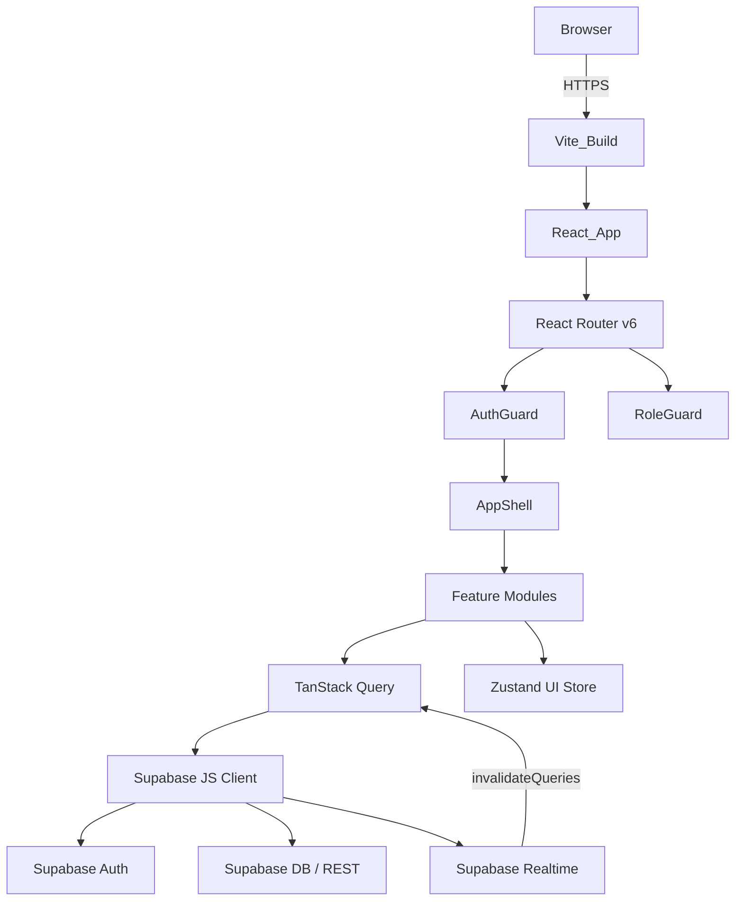
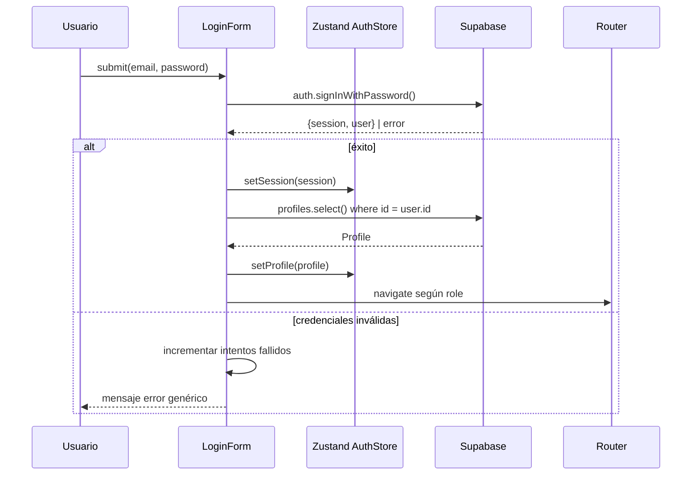
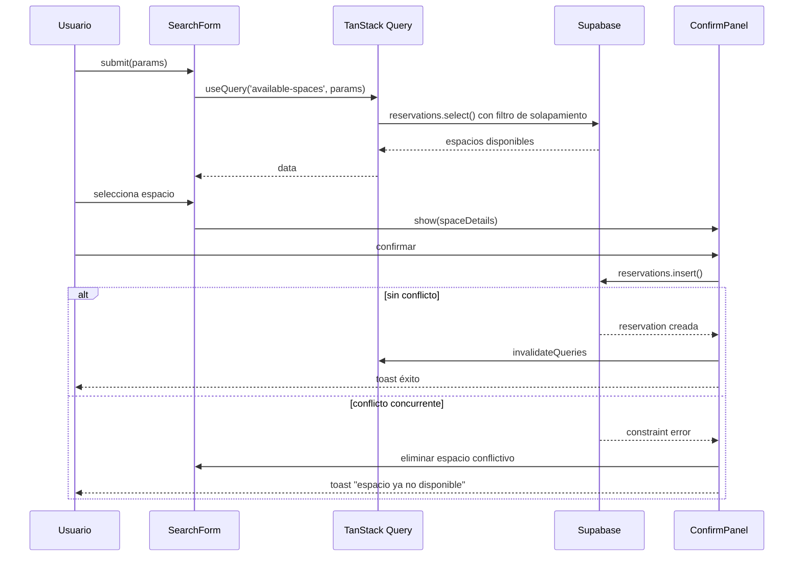
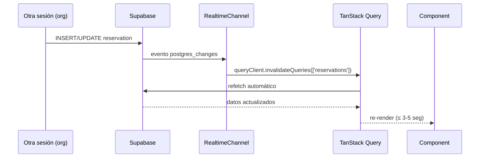

# Design Document

## Overview

La Coworking Management Platform es un SaaS Enterprise multi-tenant que permite a organizaciones gestionar espacios de trabajo compartido. El frontend es una SPA (Single Page Application) construida con **React + TypeScript**, que consume directamente la API de **Supabase** (PostgreSQL + Auth + RLS + Realtime).

### Objetivos de diseño

- Separación clara entre lógica de negocio, estado y presentación
- Autorización basada en roles (`office_manager` / `member`) aplicada en el cliente y garantizada por RLS en el servidor
- Actualizaciones en tiempo real vía Supabase Realtime para métricas de ocupación y calendario
- Bundle inicial ≤ 250KB gzip; transiciones de ruta < 200ms
- Cumplimiento WCAG 2.1 AA en todas las vistas

### Stack seleccionado

| Capa | Tecnología | Justificación |
|------|-----------|---------------|
| Framework | React 18 + TypeScript | Ecosistema maduro, soporte estricto de tipos |
| Routing | React Router v6 | Data loaders, layouts anidados, historial nativo |
| Estado servidor | TanStack Query v5 | Cache, revalidación automática, devtools |
| Estado global UI | Zustand | Ligero (~1KB), sin boilerplate |
| BaaS | Supabase JS v2 | Cliente oficial, Realtime v2, tipos generados |
| UI Components | shadcn/ui + Radix UI | Accesibilidad ARIA, headless |
| Estilos | Tailwind CSS v3 | Utility-first, purga en build |
| Gráficas | Recharts | Ligero, composable, responsive |
| Calendario | FullCalendar (React) | Vistas día/semana/mes listas |
| Formularios | React Hook Form + Zod | Validación tipada, rendimiento sin re-renders |
| Testing | Vitest + Testing Library + fast-check | PBT nativo con Vitest |
| Build | Vite | HMR instantáneo, code splitting automático |


---

## Architecture

### Estructura de carpetas

```
src/
├── app/
│   ├── App.tsx
│   ├── router.tsx
│   └── providers.tsx
├── lib/
│   ├── supabase/
│   │   ├── client.ts
│   │   ├── types.ts
│   │   └── realtime.ts
│   ├── query-client.ts
│   └── utils.ts
├── features/
│   ├── auth/
│   ├── onboarding/
│   ├── dashboard/
│   ├── spaces/
│   ├── reservations/
│   ├── calendar/
│   ├── reports/
│   └── team/
├── components/
│   ├── ui/
│   ├── layout/
│   │   ├── AppShell.tsx
│   │   ├── Sidebar.tsx
│   │   └── TopBar.tsx
│   └── shared/
│       ├── Toast.tsx
│       ├── SkeletonCard.tsx
│       ├── ConfirmDialog.tsx
│       └── AccessDeniedMessage.tsx
├── hooks/
│   ├── useAuth.ts
│   ├── useRole.ts
│   └── useDebounce.ts
├── stores/
│   ├── authStore.ts
│   └── uiStore.ts
├── types/
│   └── index.ts
└── test/
    ├── setup.ts
    └── factories/
```

### Patrón de estado

```
┌──────────────────────────────────────────────────────────┐
│                     COMPONENTE REACT                      │
│  useQuery / useMutation (TanStack)  Zustand (UI state)    │
└──────────────┬───────────────────────────────────────────┘
               │ cache layer
┌──────────────▼─────────────────┐   ┌─────────────────────┐
│     TanStack Query Cache        │◄──►│  Supabase Realtime  │
│ (datos servidor)                │   │ (push → invalidate) │
└──────────────┬──────────────────┘   └─────────────────────┘
               │
┌──────────────▼──────────────┐
│       Supabase Client        │
│  Auth · DB · Realtime        │
└──────────────────────────────┘
```

### Routing (React Router v6)

```
/                    → redirect según estado sesión
/login               → LoginPage (público)
/forgot-password     → ForgotPasswordPage (público)
/onboarding          → OnboardingPage (requiere auth + office_manager sin espacios)
/app/
  dashboard          → DashboardPage
  spaces/            → SpacesPage         [solo office_manager]
  spaces/new         → SpaceFormPage
  spaces/:id/edit    → SpaceFormPage
  reservations/      → ReservationsPage
  reservations/search → SearchPage
  calendar/          → CalendarPage
  reports/           → ReportsPage        [solo office_manager]
  team/              → TeamPage           [solo office_manager]
```

#### Guards de ruta

```typescript
<RequireAuth />                              // redirige a /login si sin sesión
<RequireRole role="office_manager" />        // redirige a /app/dashboard si sin rol
<RequireOnboarding />                        // redirige a /onboarding si sin espacios
```

### Diagrama de arquitectura




---

## Components and Interfaces

### Auth (`features/auth/`)
```
LoginPage
├── LoginForm
│   ├── EmailInput
│   ├── PasswordInput
│   ├── ErrorMessage
│   ├── LockoutMessage        # cuenta regresiva 5 min
│   └── ForgotPasswordLink
ForgotPasswordPage
└── ForgotPasswordForm
```

### Onboarding (`features/onboarding/`)
```
OnboardingPage
├── OnboardingProgress        # indicador paso 1/2
├── StepOrgName               # paso 1
│   ├── OrgNameInput
│   └── FieldError
└── StepFirstSpace            # paso 2
    ├── SpaceNameInput
    ├── SpaceTypeSelect
    └── FieldError
```

### Dashboard (`features/dashboard/`)
```
DashboardPage
├── ManagerDashboard          # office_manager
│   ├── MetricCard (espacios activos)
│   ├── MetricCard (reservas hoy)
│   ├── MetricCard (tasa ocupación)
│   ├── ReportsLink
│   └── RealtimeIndicator
└── MemberDashboard           # member
    ├── UpcomingReservationsList
    │   └── ReservationCard
    ├── QuickSearchForm
    └── CalendarLink
```

### Spaces (`features/spaces/`)
```
SpacesPage
├── SpaceListHeader
├── SpaceTable                # paginada 25/página
│   ├── SpaceRow
│   └── SpacePagination
└── SpaceFormPage
    ├── SpaceForm
    │   ├── NameInput
    │   ├── TypeSelect
    │   ├── CapacityInput
    │   └── ActiveToggle
    └── DeactivateDialog      # muestra nº reservas futuras afectadas
```

### Reservations (`features/reservations/`)
```
ReservationsPage
├── ReservationTabs           # Próximas / Pasadas
└── ReservationList
    ├── ReservationCard
    │   └── CancelButton      # solo si confirmada y futura
    └── ReservationPagination

SearchPage
├── SearchForm
│   ├── DatePicker
│   ├── TimeRangePicker
│   ├── SpaceTypeSelect
│   └── CapacityInput
├── SearchResults
│   ├── SpaceCard
│   │   └── BookButton
│   └── NoResultsMessage      # con sugerencias ±24h
└── ConfirmationPanel
    ├── ReservationDetails
    ├── ConfirmButton
    └── BackButton
```

### Calendar (`features/calendar/`)
```
CalendarPage
├── CalendarToolbar           # selector día/semana/mes
├── FullCalendarWrapper
│   ├── EventBlock            # color propio vs otros
│   └── FreeSlotHighlight     # bloques libres 08-20h
└── EventDetailPanel
    ├── SpaceInfo
    ├── TimeInfo
    └── UserInfo              # solo office_manager
```

### Reports (`features/reports/`)
```
ReportsPage
├── ReportsHeader             # rango de fechas
├── SpaceTypeFilter
├── UtilizationTable
│   └── SpaceUtilizationRow
├── OccupancyBarChart         # Recharts BarChart
├── DailyReservationsLineChart # Recharts LineChart
├── ExportCSVButton
└── EmptyReportsMessage
```

### Team (`features/team/`)
```
TeamPage
├── TeamHeader                # total miembros
├── TeamSearch                # debounce 300ms
├── TeamTable                 # paginada 25/página
│   ├── TeamMemberRow
│   │   └── RoleSelector
│   └── TeamPagination
└── SelfDemoteDialog
```


---

## Data Models

### Tipos TypeScript

```typescript
// src/types/index.ts

export type UserRole = 'office_manager' | 'member'
export type SpaceType = 'desk' | 'meeting_room' | 'phone_booth' | 'event_space'
export type ReservationStatus = 'confirmed' | 'cancelled'

export interface Organization {
  id: string
  name: string
  created_at: string
}

export interface Profile {
  id: string
  org_id: string
  full_name: string
  email: string
  role: UserRole
  created_at: string
}

export interface Space {
  id: string
  org_id: string
  name: string
  type: SpaceType
  capacity: number
  is_active: boolean
  created_at: string
}

export interface Reservation {
  id: string
  org_id: string
  space_id: string
  user_id: string
  start_time: string
  end_time: string
  status: ReservationStatus
  created_at: string
  space?: Pick<Space, 'id' | 'name' | 'type' | 'capacity'>
  profile?: Pick<Profile, 'id' | 'full_name' | 'email'>
}

export interface SpaceUtilization {
  space_id: string
  name: string
  org_id: string
  total_reservations: number
  total_hours_booked: number
  space_type?: SpaceType
  occupancy_rate?: number | null
}

export interface AuthUser {
  id: string
  email: string
  profile: Profile
  org_id: string
}

export interface SpaceFormData {
  name: string
  type: SpaceType
  capacity: number
  is_active: boolean
}

export interface ReservationSearchParams {
  date: string
  start_time: string
  end_time: string
  space_type?: SpaceType
  min_capacity?: number
}
```

### Esquemas Zod clave

```typescript
// features/spaces/schemas.ts
export const SpaceFormSchema = z.object({
  name: z.string().min(2).max(100),
  type: z.enum(['desk', 'meeting_room', 'phone_booth', 'event_space']),
  capacity: z.number().int().min(1).max(500),
  is_active: z.boolean(),
})

// features/reservations/schemas.ts
export const ReservationSearchSchema = z.object({
  date: z.string().regex(/^\d{4}-\d{2}-\d{2}$/),
  start_time: z.string().regex(/^\d{2}:\d{2}$/),
  end_time: z.string().regex(/^\d{2}:\d{2}$/),
  space_type: z.enum(['desk', 'meeting_room', 'phone_booth', 'event_space']).optional(),
  min_capacity: z.number().int().min(1).max(999).optional(),
}).refine(
  (d) => d.end_time > d.start_time,
  { message: 'La hora de fin debe ser posterior a la hora de inicio', path: ['end_time'] }
).refine(
  (d) => new Date(d.date) >= new Date(new Date().toDateString()),
  { message: 'La fecha no puede ser anterior a hoy', path: ['date'] }
)
```


---

## Flujos de Datos

### 1. Autenticación y sesión



### 2. Búsqueda y creación de reserva



### 3. Actualizaciones Realtime




---

## Integración con Supabase

### Cliente singleton

```typescript
// src/lib/supabase/client.ts
import { createClient } from '@supabase/supabase-js'
import type { Database } from './types'

export const supabase = createClient<Database>(
  import.meta.env.VITE_SUPABASE_URL,
  import.meta.env.VITE_SUPABASE_ANON_KEY,
  {
    auth: {
      persistSession: true,
      autoRefreshToken: true,
      detectSessionInUrl: true,
    },
  }
)
```

### Hooks personalizados

```typescript
// features/spaces/hooks.ts
export function useSpaces() {
  return useQuery({
    queryKey: ['spaces'],
    queryFn: async () => {
      const { data, error } = await supabase
        .from('spaces')
        .select('*')
        .order('created_at', { ascending: false })
      if (error) throw error
      return data
    },
    staleTime: 30_000,
  })
}

// features/reservations/hooks.ts — detección de solapamiento exacta
export function useAvailableSpaces(params: ReservationSearchParams) {
  return useQuery({
    queryKey: ['available-spaces', params],
    queryFn: async () => {
      const startISO = `${params.date}T${params.start_time}:00`
      const endISO   = `${params.date}T${params.end_time}:00`
      const { data: occupied } = await supabase
        .from('reservations')
        .select('space_id')
        .eq('status', 'confirmed')
        .lt('start_time', endISO)
        .gt('end_time', startISO)
      const occupiedIds = occupied?.map(r => r.space_id) ?? []
      let query = supabase.from('spaces').select('*').eq('is_active', true)
      if (occupiedIds.length > 0)
        query = query.not('id', 'in', `(${occupiedIds.join(',')})`)
      if (params.space_type) query = query.eq('type', params.space_type)
      if (params.min_capacity && params.min_capacity >= 1 && params.min_capacity <= 999)
        query = query.gte('capacity', params.min_capacity)
      const { data, error } = await query.order('name')
      if (error) throw error
      return data
    },
    enabled: !!params.date && !!params.start_time && !!params.end_time,
  })
}
```

### Suscripciones Realtime

```typescript
// src/lib/supabase/realtime.ts
export function subscribeToOrgReservations(orgId: string, onEvent: () => void) {
  return supabase
    .channel(`org-reservations-${orgId}`)
    .on('postgres_changes', {
      event: '*',
      schema: 'public',
      table: 'reservations',
      filter: `org_id=eq.${orgId}`,
    }, onEvent)
    .subscribe()
}

export function useReservationRealtime() {
  const { profile } = useAuthStore()
  const qc = useQueryClient()
  useEffect(() => {
    if (!profile?.org_id) return
    const channel = subscribeToOrgReservations(profile.org_id, () => {
      qc.invalidateQueries({ queryKey: ['reservations'] })
      qc.invalidateQueries({ queryKey: ['available-spaces'] })
    })
    return () => { supabase.removeChannel(channel) }
  }, [profile?.org_id, qc])
}
```


---

## Autenticación y Autorización

### Zustand AuthStore

```typescript
// src/stores/authStore.ts
interface AuthState {
  session: Session | null
  profile: Profile | null
  isLoading: boolean
  setSession: (s: Session | null) => void
  setProfile: (p: Profile | null) => void
  clear: () => void
}

export const useAuthStore = create<AuthState>()(
  persist(
    (set) => ({
      session: null, profile: null, isLoading: true,
      setSession: (session) => set({ session }),
      setProfile: (profile) => set({ profile }),
      clear: () => set({ session: null, profile: null }),
    }),
    { name: 'auth-store' }
  )
)
```

### Hook de inactividad (60 minutos)

```typescript
// src/hooks/useInactivityTimeout.ts
export function useInactivityTimeout(timeoutMs = 60 * 60 * 1000) {
  useEffect(() => {
    let timer: ReturnType<typeof setTimeout>
    const reset = () => {
      clearTimeout(timer)
      timer = setTimeout(() => supabase.auth.signOut(), timeoutMs)
    }
    const events = ['mousemove', 'keydown', 'click', 'scroll']
    events.forEach(e => window.addEventListener(e, reset))
    reset()
    return () => {
      clearTimeout(timer)
      events.forEach(e => window.removeEventListener(e, reset))
    }
  }, [timeoutMs])
}
```

### Guards de ruta

```typescript
// RequireAuth — redirige a /login si no hay sesión
export function RequireAuth({ children }: { children: ReactNode }) {
  const { session, isLoading } = useAuthStore()
  const location = useLocation()
  if (isLoading) return <FullPageSpinner />
  if (!session) return <Navigate to="/login" state={{ from: location }} replace />
  return <>{children}</>
}

// RequireRole — redirige a /app/dashboard si el rol no coincide
export function RequireRole({ role, children }: { role: UserRole; children: ReactNode }) {
  const { profile } = useAuthStore()
  const navigate = useNavigate()
  if (profile?.role !== role) {
    navigate('/app/dashboard', { replace: true })
    return null
  }
  return <>{children}</>
}
```


---

## Error Handling

### Jerarquía de manejo de errores

```
Nivel 1 — React Error Boundary (errores de render inesperados)
  └─ ErrorBoundary.tsx → página de error con opción "Reintentar"

Nivel 2 — TanStack Query (errores de fetch/mutación)
  ├─ onError global: toast de error por defecto
  └─ onError local: revertir UI optimista + toast descriptivo

Nivel 3 — Validación Zod (errores de formulario)
  └─ react-hook-form: error inline junto a cada campo

Nivel 4 — Errores de negocio Supabase (RLS, constraints)
  └─ parseSupabaseError(error) → mensaje amigable en español
```

### Parseo de errores Supabase

```typescript
export function parseSupabaseError(error: PostgrestError): string {
  const map: Record<string, string> = {
    '23505': 'Ya existe un registro con esos datos.',
    '23503': 'El elemento relacionado no existe.',
    '42501': 'No tienes permisos para realizar esta acción.',
    'PGRST116': 'No se encontraron resultados.',
  }
  return map[error.code] ?? `Error del servidor: ${error.message}`
}
```

### Comportamiento de toasts por tipo

| Tipo | Duración | Comportamiento |
|------|----------|---------------|
| Éxito | 4 seg | Auto-descarte |
| Error | 8 seg o manual | Persiste hasta X o timeout |
| Info | 4 seg | Auto-descarte |
| Advertencia | 6 seg | Auto-descarte |

---

## Sistema de Diseño

### Design tokens (Tailwind)

```typescript
// tailwind.config.ts
const colors = {
  primary:     { DEFAULT: '#4F46E5', foreground: '#FFFFFF' }, // indigo-600
  secondary:   { DEFAULT: '#0EA5E9', foreground: '#FFFFFF' }, // sky-500
  accent:      { DEFAULT: '#F59E0B', foreground: '#1C1917' }, // amber-500
  destructive: { DEFAULT: '#EF4444', foreground: '#FFFFFF' }, // red-500
  background:  '#F8FAFC',
  surface:     '#FFFFFF',
  border:      '#E2E8F0',
  muted:       { DEFAULT: '#F1F5F9', foreground: '#64748B' },
}
```

### Tipografía

| Uso | Fuente | Peso | Tamaño |
|-----|--------|------|--------|
| Headings | Inter | 600–700 | 1.25–2rem |
| Body | Inter | 400 | 0.875–1rem |
| Code | JetBrains Mono | 400 | 0.8125rem |
| Labels | Inter | 500 | 0.75rem |

### Colores del calendario (WCAG AA)

| Tipo de reserva | Color | Contraste vs fondo |
|-----------------|-------|-------------------|
| Propia del usuario | `#4F46E5` indigo | ≥ 4.5:1 |
| Otros miembros | `#0EA5E9` sky | ≥ 4.5:1 |

### Loading states

| Componente | Estado de carga |
|------------|----------------|
| Tablas | SkeletonTable (5 filas) |
| Gráficas | SkeletonChart (rect 300px) |
| Métricas dashboard | SkeletonCard (3 tarjetas) |
| Calendario | SkeletonCalendar |
| Panel detalles | SkeletonPanel |

Umbral: loading aparece si la operación tarda ≥ 301ms (controlado con `setTimeout` de 300ms).

### Toast notifications

| Tipo | Duración | Comportamiento |
|------|----------|---------------|
| Éxito | 4 seg | Auto-descarte |
| Error | 8 seg o manual | Persiste hasta X o timeout |
| Info | 4 seg | Auto-descarte |

### Manejo de errores — jerarquía

```
Nivel 1 — React Error Boundary (errores de render)
  └─ ErrorBoundary.tsx → página de error con "Reintentar"

Nivel 2 — TanStack Query (errores de fetch/mutación)
  ├─ onError global: toast de error por defecto
  └─ onError local: revertir UI optimista + toast descriptivo

Nivel 3 — Validación Zod (errores de formulario)
  └─ react-hook-form: error inline junto a cada campo

Nivel 4 — Errores de negocio Supabase (RLS, constraints)
  └─ parseSupabaseError(error) → mensaje amigable
```

```typescript
// src/lib/utils.ts
export function parseSupabaseError(error: PostgrestError): string {
  const map: Record<string, string> = {
    '23505': 'Ya existe un registro con esos datos.',
    '23503': 'El elemento relacionado no existe.',
    '42501': 'No tienes permisos para realizar esta acción.',
    'PGRST116': 'No se encontraron resultados.',
  }
  return map[error.code] ?? `Error del servidor: ${error.message}`
}
```


---

## Correctness Properties

### Property 1: Redirección post-login determinada por rol
Para cualquier perfil autenticado, la lógica de redirección debe dirigir a `/app/dashboard` de administración si el rol es `office_manager`, y al dashboard de miembro si el rol es `member`.
**Validates: Requirements 1.2**

### Property 2: Guard de rutas redirige usuarios no autenticados
Para cualquier ruta bajo `/app/`, si el usuario no tiene sesión activa, el guard debe redirigir a `/login`.
**Validates: Requirements 1.8**

### Property 3: Validación de longitud de cadenas en formularios
Para cualquier string con longitud ∈ [2, 100], el schema Zod debe aceptarlo. Para longitudes < 2 o > 100, debe retornar error de validación.
**Validates: Requirements 2.2, 2.3**

### Property 4: Validación de SpaceFormData completa
Para cualquier `SpaceFormData`, el schema lo acepta si y solo si: `name.length ∈ [2, 100]`, `type ∈ {desk, meeting_room, phone_booth, event_space}`, `capacity ∈ [1, 500]`. Si alguna condición falla, el schema retorna error en el campo correspondiente.
**Validates: Requirements 4.2, 4.3, 4.4**

### Property 5: Paginación — ítems por página nunca excede 25
Para cualquier lista de N elementos, la vista paginada de la página P contiene `min(N - (P-1)*25, 25)` ítems.
**Validates: Requirements 4.1, 9.1**

### Property 6: Desactivación de espacio — count y cancelación correctos
Para un espacio con N reservas futuras confirmadas: el diálogo muestra exactamente N, y tras confirmar, todas las N tienen `status = 'cancelled'`.
**Validates: Requirements 4.7, 4.8**

### Property 7: Detección de solapamiento de reservas
Para cualquier par de intervalos, hay solapamiento si y solo si `existing_start < requested_end AND existing_end > requested_start`. Los resultados de búsqueda no incluyen espacios con reservas solapantes.
**Validates: Requirements 5.2**

### Property 8: Ignorar filtro de capacidad fuera de rango
Para cualquier `min_capacity` fuera de [1, 999], el resultado debe ser idéntico al resultado sin filtro de capacidad.
**Validates: Requirements 5.3**

### Property 9: Validación del schema de búsqueda
Para cualquier par donde `end_time ≤ start_time`, el schema retorna error en `end_time`. Para cualquier fecha anterior a hoy, retorna error en `date`.
**Validates: Requirements 5.5, 5.6**

### Property 10: Prevención de conflictos concurrentes
Para cualquier intento de crear reserva sobre espacio ya ocupado concurrentemente, el sistema bloquea la inserción antes de ejecutar cualquier operación en la base de datos.
**Validates: Requirements 6.4**

### Property 11: Rechazo de cancelación de reservas pasadas
Para cualquier reserva con `start_time ≤ Date.now()`, el intento de cancelación no ejecuta ninguna llamada a Supabase y el estado no cambia.
**Validates: Requirements 6.7**

### Property 12: Ordenación ascendente de reservas
Para cualquier lista de N reservas, la lista renderizada cumple que para todo `i < j`: `reservas[i].start_time ≤ reservas[j].start_time`.
**Validates: Requirements 6.8**

### Property 13: Privacidad de datos en Calendar_View para member
Para cualquier reserva de otro usuario vista desde rol `member`, el panel lateral no contiene `full_name` ni `email` del reservante.
**Validates: Requirements 7.7**

### Property 14: Cálculo de tasa de ocupación
Para cualquier `(total_hours_booked, daily_capacity_hours)`, el resultado es `round((total_hours_booked / (daily_capacity_hours * 30)) * 100, 1)`. Si `daily_capacity_hours = 0`, retorna `null`.
**Validates: Requirements 8.2**

### Property 15: Completitud de serie temporal de 30 días
El array de datos para la gráfica de línea contiene exactamente 30 puntos. Los días sin reservas tienen valor `0`.
**Validates: Requirements 8.3**

### Property 16: Filtrado correcto por tipo de espacio en Reporting
Con filtro activo, todos los registros en tabla y gráficas corresponden al tipo seleccionado. No aparece ningún registro de tipo diferente.
**Validates: Requirements 8.4**

### Property 17: CSV refleja filtro activo y columnas requeridas
El CSV exportado contiene exactamente las columnas `space_id, name, org_id, total_reservations, total_hours_booked, space_type` y solo filas del tipo filtrado activo.
**Validates: Requirements 8.5**

### Property 18: Indicador de total de miembros
Para cualquier array de N perfiles, el indicador numérico en el header muestra exactamente N.
**Validates: Requirements 9.4**

### Property 19: Bloqueo de degradación del último office_manager
Para cualquier organización con exactamente 1 `office_manager`, cualquier intento de degradarlo bloquea la acción antes de llamar a Supabase.
**Validates: Requirements 9.6**

### Property 20: Reversión de rol cuando falla el cambio
Para cualquier cambio de rol donde la mutación falla, el rol mostrado revierte a `role_anterior` y el estado en Supabase no se modifica.
**Validates: Requirements 9.9**

### Property 21: Loading state para operaciones ≥ 301ms
Para cualquier operación que tarde ≥ 301ms, el componente muestra skeleton/spinner antes de recibir la respuesta. Si resuelve en ≤ 300ms, no se muestra.
**Validates: Requirements 10.3**

### Property 22: Restauración de filtros al navegar atrás
Para cualquier combinación de filtros activos al salir de una vista, al navegar atrás el estado restaurado es idéntico al estado al momento de salir.
**Validates: Requirements 10.10**


---

## Testing Strategy

### Herramientas

| Herramienta | Propósito |
|-------------|-----------|
| Vitest | Test runner (Vite, ESM nativo) |
| @testing-library/react | Tests de componentes |
| @testing-library/user-event | Simulación de interacciones |
| fast-check | Property-based testing |
| msw | Mock de Supabase API |
| @axe-core/react | Auditoría de accesibilidad |
| Playwright | Tests e2e en 3 navegadores |

### Organización de property tests

```
src/test/properties/
  ├── auth.property.test.ts         — Properties 1, 2
  ├── validation.property.test.ts   — Properties 3, 4, 9
  ├── pagination.property.test.ts   — Property 5
  ├── spaces.property.test.ts       — Properties 5, 6
  ├── overlap.property.test.ts      — Properties 7, 8, 10
  ├── reservations.property.test.ts — Properties 11, 12
  ├── calendar.property.test.ts     — Property 13
  ├── reports.property.test.ts      — Properties 14, 15, 16, 17
  ├── team.property.test.ts         — Properties 18, 19, 20
  └── ux.property.test.ts           — Properties 21, 22
```

### Ejemplo de property test (Property 7)

```typescript
// Tag: Feature: coworking-management-platform, Property 7: Detección de solapamiento
import * as fc from 'fast-check'
import { describe, it, expect } from 'vitest'
import { filterAvailableSpaces } from '@/features/reservations/overlap'

describe('Property 7: Detección de solapamiento de reservas', () => {
  it('un espacio ocupado no aparece en resultados', () => {
    fc.assert(
      fc.property(
        fc.record({
          requestedStart: fc.date({ min: new Date() }),
          requestedEnd:   fc.date({ min: new Date() }),
        }).filter(({ requestedStart, requestedEnd }) => requestedEnd > requestedStart),
        fc.array(
          fc.record({
            id: fc.uuid(),
            start_time: fc.date({ min: new Date() }),
            end_time:   fc.date({ min: new Date() }),
            status: fc.constant('confirmed' as const),
          }).filter(r => r.end_time > r.start_time),
          { minLength: 1, maxLength: 10 }
        ),
        ({ requestedStart, requestedEnd }, existingReservations) => {
          const overlapping = existingReservations.filter(r =>
            r.start_time < requestedEnd && r.end_time > requestedStart
          )
          const result = filterAvailableSpaces(
            existingReservations, requestedStart, requestedEnd
          )
          expect(
            result.filter(r => overlapping.some(o => o.id === r.id))
          ).toHaveLength(0)
        }
      ),
      { numRuns: 100 }
    )
  })
})
```

### Tests e2e (Playwright)

```
e2e/
  ├── auth.spec.ts           — Login, logout, recuperación, inactividad
  ├── onboarding.spec.ts     — Flujo completo de onboarding
  ├── reservations.spec.ts   — Búsqueda, creación, cancelación
  ├── calendar.spec.ts       — Vistas, Realtime, privacidad roles
  ├── spaces.spec.ts         — CRUD, desactivación con reservas
  ├── reports.spec.ts        — Tabla, gráficas, exportación CSV
  └── team.spec.ts           — Cambio de roles, protección último manager
```

Playwright configurado con proyectos: `chromium`, `firefox`, `webkit` (Requirement 10.7).

### Configuración fast-check

```typescript
// src/test/setup.ts
import { configure } from 'fast-check'
configure({ numRuns: 100 }) // mínimo 100 iteraciones por property test
```

### Tags de propiedades (formato estándar)

```
Feature: coworking-management-platform, Property 1: Redirección post-login determinada por rol
Feature: coworking-management-platform, Property 2: Guard de rutas redirige usuarios no autenticados
Feature: coworking-management-platform, Property 3: Validación de longitud de cadenas en formularios
Feature: coworking-management-platform, Property 4: Validación de SpaceFormData completa
Feature: coworking-management-platform, Property 5: Paginación — ítems por página nunca excede 25
Feature: coworking-management-platform, Property 6: Desactivación de espacio — count y cancelación correctos
Feature: coworking-management-platform, Property 7: Detección de solapamiento de reservas
Feature: coworking-management-platform, Property 8: Ignorar filtro de capacidad fuera de rango
Feature: coworking-management-platform, Property 9: Validación del schema de búsqueda
Feature: coworking-management-platform, Property 10: Prevención de conflictos concurrentes
Feature: coworking-management-platform, Property 11: Rechazo de cancelación de reservas pasadas
Feature: coworking-management-platform, Property 12: Ordenación ascendente de reservas
Feature: coworking-management-platform, Property 13: Privacidad de datos en Calendar_View para member
Feature: coworking-management-platform, Property 14: Cálculo de tasa de ocupación por espacio
Feature: coworking-management-platform, Property 15: Completitud de serie temporal de 30 días
Feature: coworking-management-platform, Property 16: Filtrado correcto por tipo de espacio en Reporting
Feature: coworking-management-platform, Property 17: CSV refleja filtro activo y columnas requeridas
Feature: coworking-management-platform, Property 18: Indicador de total de miembros
Feature: coworking-management-platform, Property 19: Bloqueo de degradación del último office_manager
Feature: coworking-management-platform, Property 20: Reversión de rol cuando falla el cambio
Feature: coworking-management-platform, Property 21: Loading state para operaciones lentas
Feature: coworking-management-platform, Property 22: Restauración de filtros al navegar atrás
```
